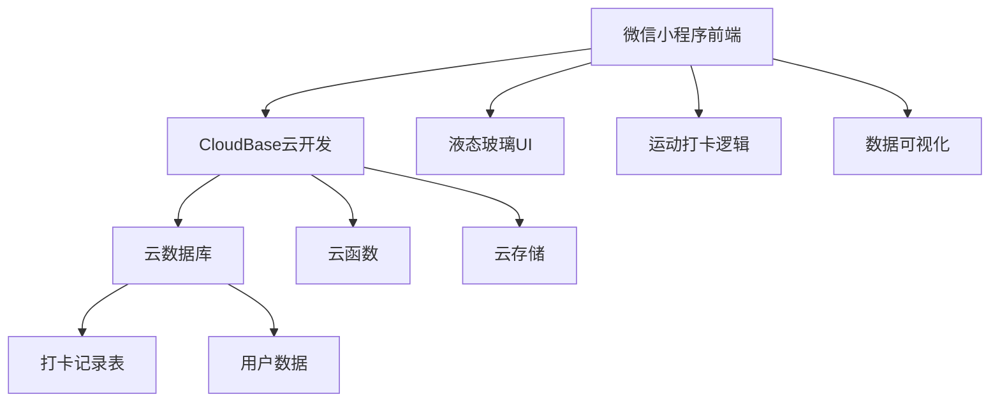

# 🏃‍♂️ 运动打卡小程序

一个极简而美观的运动打卡小程序，采用现代液态玻璃设计风格，基于微信小程序和腾讯CloudBase云开发平台构建。

## ✨ 功能特性

### 核心功能
- 🎯 **一键打卡** - 简单快速的运动打卡体验
- 🏃‍♂️ **运动类型** - 支持跑步、骑行、游泳、健身等8种运动类型
- 📊 **数据统计** - 本周打卡、总计打卡、连续打卡统计
- 📅 **打卡历史** - 可视化日历展示打卡记录
- 🎨 **现代设计** - 液态玻璃风格，流畅动画效果

### 设计亮点
- 💎 **液态玻璃效果** - 半透明毛玻璃材质，层次分明
- 🌈 **渐变配色** - 紫蓝色渐变背景，视觉舒适
- ⚡ **流畅动画** - 丝滑的交互动效和页面转场
- 📱 **响应式设计** - 适配各种屏幕尺寸

## 🏗️ 技术架构



### 技术栈
- **前端框架**: 微信小程序原生开发
- **UI设计**: 液态玻璃风格 + CSS3动画
- **后端服务**: 腾讯CloudBase云开发
- **数据库**: CloudBase云数据库 (MongoDB)
- **部署**: CloudBase一键部署

### 项目结构
```
运动打卡/
├── app.js                 # 小程序入口文件
├── app.json              # 小程序配置
├── app.wxss              # 全局样式
├── components/           # 组件目录
│   └── navigation-bar/   # 自定义导航栏
├── pages/               # 页面目录
│   ├── index/          # 主打卡页面
│   │   ├── index.js    # 页面逻辑
│   │   ├── index.wxml  # 页面结构
│   │   ├── index.wxss  # 页面样式
│   │   └── index.json  # 页面配置
│   └── history/        # 打卡历史页面
│       ├── history.js
│       ├── history.wxml
│       ├── history.wxss
│       └── history.json
├── project.config.json  # 项目配置
└── README.md           # 项目文档
```

## 🚀 快速开始

### 环境要求
- 微信开发者工具
- 腾讯云账号
- CloudBase环境

### 安装步骤

1. **克隆项目**
   ```bash
   git clone [项目地址](https://github.com/328599138/sports-checkin-miniprogram)
   cd 运动打卡
   ```

2. **配置CloudBase环境**
   - 登录[腾讯云控制台](https://console.cloud.tencent.com/)
   - 开通CloudBase服务
   - 创建环境，记录环境ID

3. **修改配置**
   ```javascript
   // app.js 中修改环境ID
   wx.cloud.init({
     env: 'your-env-id', // 替换为你的环境ID
     traceUser: true
   });
   ```

4. **数据库配置**
   - 在CloudBase控制台创建数据库集合 `sports_checkin`
   - 设置数据库权限为"仅创建者可读写"

5. **运行项目**
   - 使用微信开发者工具打开项目
   - 编译预览

## 📊 数据结构

### 打卡记录表 (sports_checkin)
```javascript
{
  "_id": "记录ID",
  "openid": "用户openid",
  "date": "2025-01-10", // 打卡日期
  "datetime": "2025-01-10T10:30:00.000Z", // 打卡时间
  "sportType": "running", // 运动类型
  "sportName": "跑步", // 运动名称
  "timestamp": 1704875400000 // 时间戳
}
```

## 🎨 设计系统

### 色彩方案
- **主色调**: `#667eea` → `#764ba2` (紫蓝渐变)
- **强调色**: `#ff6b6b` → `#ffd93d` (橙红渐变)
- **成功色**: `#4ecdc4` → `#44a08d` (青绿渐变)
- **玻璃效果**: `rgba(255, 255, 255, 0.15)`

### 设计原则
- **层次感**: 通过毛玻璃效果营造空间层次
- **流动性**: 圆角、渐变、动画营造流动感
- **简约性**: 专注核心功能，避免复杂操作
- **一致性**: 统一的视觉语言和交互模式

## 🔧 开发指南

### 添加新运动类型
```javascript
// 在 pages/index/index.js 中添加
sportTypes: [
  { id: 'newSport', name: '新运动', emoji: '🎯' }
]
```

### 自定义主题色
```css
/* 在 app.wxss 中修改 */
page {
  --primary-color: #your-color;
  --secondary-color: #your-color;
}
```

### 添加新统计维度
1. 修改数据查询逻辑
2. 更新UI显示组件
3. 添加相应的样式

## 📱 功能演示

### 主打卡页面
- 显示当前日期和星期
- 大型圆形打卡按钮
- 运动类型选择网格
- 统计数据卡片

### 打卡历史页面
- 月度统计概览
- 可视化打卡日历
- 最近打卡记录列表
- 月份切换功能

## 🌟 特色功能

### 连续打卡计算
智能计算用户的连续打卡天数，激励用户坚持运动。

### 运动类型统计
支持多种运动类型，每种运动都有专属的emoji图标。

### 响应式日历
美观的日历界面，直观显示打卡状态和运动类型。

## 📈 性能优化

- **数据缓存**: 本地缓存用户openid
- **懒加载**: 按需加载历史数据
- **动画优化**: 使用CSS3硬件加速
- **图片优化**: 使用emoji减少图片资源

## 🐛 常见问题

### Q: 数据库连接失败？
A: 检查CloudBase环境ID是否正确配置。

### Q: 打卡数据不显示？
A: 确认数据库权限设置正确。

### Q: 样式显示异常？
A: 确认小程序基础库版本 ≥ 3.0.0。

### Q: 历史页面返回按钮看不见？
A: 已修复导航栏返回按钮在深色背景上的可见性问题。

### Q: 首页底部按钮显示不全？
A: 已增加底部内边距，确保按钮完全显示。

### Q: 控制台显示 FUNCTION_NOT_FOUND 错误？
A: 需要部署云函数，请参考 `cloudbase/deploy.md` 部署指南。

### Q: 云函数部署失败？
A: 确认已开通CloudBase服务，并在微信开发者工具中配置了正确的环境ID。

## 📝 更新日志

### v1.2.0 (2025-07-05) - CloudBase完整版
- 🚀 **重大更新**：完全采用CloudBase云开发架构
- ☁️ 创建完整的云函数体系：`getOpenId` 和 `userManager`
- 🔐 使用真实的微信openid进行用户标识
- 📊 云端统计计算，性能大幅提升
- 🛡️ 完善的错误处理和权限管理
- 📖 提供详细的云函数部署指南

### v1.1.1 (2025-07-04)
- 🐛 修复云函数调用错误 (FUNCTION_NOT_FOUND)
- 🔧 改用本地存储方式管理用户标识，无需依赖云函数
- 🐛 进一步优化底部按钮显示问题
- 📱 适配底部安全区域，提升全面屏体验

### v1.1.0 (2025-07-04)
- 🐛 修复历史页面返回按钮在深色背景上不可见的问题
- 🐛 修复首页底部按钮显示不全的问题
- ✨ 增强打卡成功后的用户反馈体验
- 🎨 优化导航栏返回按钮的视觉效果和交互

### v1.0.0 (2025-07-04)
- 🎉 初始版本发布
- ✨ 基础打卡功能
- 🎨 液态玻璃设计风格
- 📊 统计和历史功能

## 🤝 贡献指南

欢迎提交Issue和Pull Request！

1. Fork 项目
2. 创建功能分支
3. 提交更改
4. 发起Pull Request

## 📄 开源协议

MIT License

## 👨‍💻 作者信息

- **开发者**: 阿肯
- **邮箱**: 934026@qq.com
- **GitHub**: [328599138](https://github.com/328599138)

---

⭐ 如果这个项目对你有帮助，请给个Star支持一下！ 
